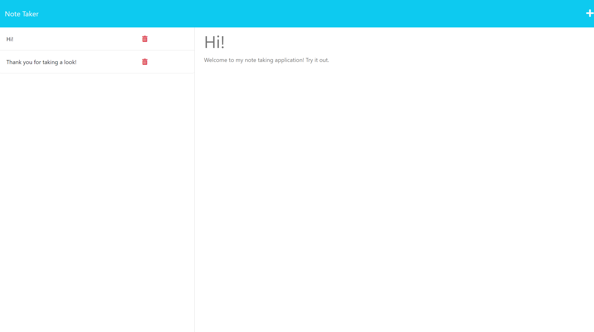

# Note Taker
  
  

  ## Description
  This project creates an Express.js backend to a note taker application. The program saves, retrieves, and delete notes from a JSON file.

  ## Table of Contents
  1. [Installation](#installation)
  2. [Usage](#usage)
  3. [License](#license)
  4. [Questions](#questions)

  ## Installation
  N/A

  ## Usage
  
  
  Once the webpage is open, it will render the existing notes on the left. You can add a note by first filling in the title and description, then a save button will appear in the top right. When the save button is click it will add the note to the left column. You can render a note description by clicking the title, and clicking the trash icon next to the title will permanently remove the note.

  
  Click [here](https://taes-note-taker.herokuapp.com/) to go to my deployed webpage on Heroku. `link disabled until further notice`
  
---
  ## License
  This project is licensed under the MIT license.
  
  ## Questions
  If you have any questions about the repo, open an issue or contact me directly at [amfrazier01@gmail.com](mailto:amfrazier01@gmail.com). You can find more of my work at [afrazier01](https://github.com/afrazier01)
